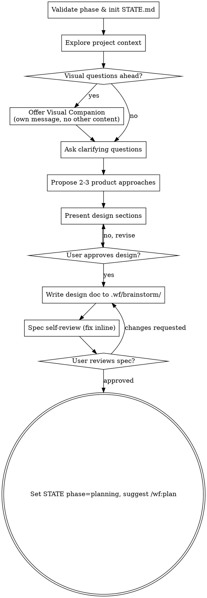

# wf:brainstorm

Help turn ideas into fully formed designs and specs through natural collaborative dialogue. This is stage 1 of 4 in the wf workflow.

Start by understanding the current project context, then ask questions one at a time to refine the idea. Once you understand what you're building, present the design and get user approval.

<HARD-GATE>
Do NOT invoke any implementation skill, write any code, scaffold any project, or take any implementation action until you have presented a design and the user has approved it. This applies to EVERY project regardless of perceived simplicity.
</HARD-GATE>

## Phase Validation

Before doing anything else:

1. Read `.wf/STATE.md` if it exists.
2. If `STATE.md` exists and its `phase` is not `brainstorm` or `done` and not absent, refuse to proceed. Tell the user the current phase and suggest the matching `/wf:*` command.
3. If `.wf/STATE.md` does not exist or its phase is `done`, treat this as a new feature: confirm a one-line task description with the user, then create `.wf/`, append `.wf/` to the project's `.gitignore` (only if not already present), and initialize a fresh STATE.md.

## Anti-Pattern: "This Is Too Simple To Need A Design"

Every project goes through this process. A todo list, a single-function utility, a config change — all of them. "Simple" projects are where unexamined assumptions cause the most wasted work. The design can be short (a few sentences for truly simple projects), but you MUST present it and get approval.

## Checklist

You MUST create a task for each of these items and complete them in order:

1. **Validate phase & initialize STATE.md** — see Phase Validation above
2. **Explore project context** — check files, docs, recent commits
3. **Offer visual companion** (if topic will involve visual questions) — its own message, not combined with a clarifying question. See Visual Companion below.
4. **Ask clarifying questions** — one at a time, understand purpose/constraints/success criteria
5. **Propose 2-3 product/UX-level approaches** — with trade-offs and your recommendation. Architecture-level alternatives belong in `/wf:plan`, not here.
6. **Present design** — in sections scaled to their complexity, get user approval after each section
7. **Write design doc** — save to `.wf/brainstorm/<feature_id>.md`. Do NOT commit to git.
8. **Spec self-review** — quick inline check for placeholders, contradictions, scope, ambiguity (see below)
9. **User reviews written spec** — ask user to review the spec file before proceeding
10. **Hand off to /wf:plan** — set `phase: planning` in STATE.md and tell the user to run `/wf:plan` when ready. Do NOT auto-invoke any other skill.

## STATE.md Format

```yaml
---
feature_id: <YYYYMMDDTHHMMSS>-<kebab-slug>
phase: brainstorm
created_at: <ISO 8601 with timezone, e.g. 2026-04-28T14:32:00+08:00>
review_round: 0
---

## Current Task
<one-liner>

## Phase Log
- <ISO 8601 timestamp> brainstorm started
```

The `feature_id` is `created_at` collapsed (drop punctuation) plus a kebab-case slug, e.g. `20260428T143200-house-hunting`.

## Process Flow



The terminal state is **handing control to the user** with `phase: planning` set in STATE.md. Do NOT auto-invoke `/wf:plan` or any other skill — the user runs the next command when they're ready.

## The Process

**Understanding the idea:**

- Check out the current project state first (files, docs, recent commits)
- Before asking detailed questions, assess scope: if the request describes multiple independent subsystems (e.g., "build a platform with chat, file storage, billing, and analytics"), flag this immediately. Don't spend questions refining details of a project that needs to be decomposed first.
- If the project is too large for a single spec, help the user decompose into sub-projects: what are the independent pieces, how do they relate, what order should they be built? Then brainstorm the first sub-project through the normal design flow. Each sub-project gets its own brainstorm → plan → code → review cycle.
- For appropriately-scoped projects, ask questions one at a time to refine the idea
- Prefer multiple choice questions when possible, but open-ended is fine too
- Only one question per message — if a topic needs more exploration, break it into multiple questions
- Focus on understanding: purpose, constraints, success criteria

**Exploring approaches:**

- Propose 2-3 different **product/UX-level** approaches with trade-offs. Architecture-level alternatives are deferred to `/wf:plan`.
- Present options conversationally with your recommendation and reasoning
- Lead with your recommended option and explain why

**Presenting the design:**

- Once you believe you understand what you're building, present the design
- Scale each section to its complexity: a few sentences if straightforward, up to 200-300 words if nuanced
- Ask after each section whether it looks right so far
- Cover: user-facing behavior, scope boundaries, success criteria. Architecture details are deferred to `/wf:plan`.
- Be ready to go back and clarify if something doesn't make sense

**Design for isolation and clarity:**

- Break the system into smaller units that each have one clear purpose, communicate through well-defined interfaces, and can be understood and tested independently
- For each unit, you should be able to answer: what does it do, how do you use it, and what does it depend on?
- Can someone understand what a unit does without reading its internals? Can you change the internals without breaking consumers? If not, the boundaries need work.

**Working in existing codebases:**

- Explore the current structure before proposing changes. Follow existing patterns.
- Where existing code has problems that affect the work (e.g., a file that's grown too large, unclear boundaries, tangled responsibilities), include targeted improvements as part of the design — the way a good developer improves code they're working in.
- Don't propose unrelated refactoring. Stay focused on what serves the current goal.

## After the Design

**Documentation:**

Write the validated design to `.wf/brainstorm/<feature_id>.md`. Do NOT commit it to git — `.wf/` is gitignored by default.

**Spec Self-Review:**
After writing the spec document, look at it with fresh eyes:

1. **Placeholder scan:** Any "TBD", "TODO", incomplete sections, or vague requirements? Fix them.
2. **Internal consistency:** Do any sections contradict each other? Does the design match the original request?
3. **Scope check:** Is this focused enough for a single implementation plan, or does it need decomposition?
4. **Ambiguity check:** Could any requirement be interpreted two different ways? If so, pick one and make it explicit.

Fix any issues inline. No need to re-review — just fix and move on.

**User Review Gate:**
After the spec review loop passes, ask the user to review the written spec before proceeding:

> "Spec written to `.wf/brainstorm/<feature_id>.md`. Please review it and let me know if you want any changes before we move to the planning stage."

Wait for the user's response. If they request changes, make them and re-run the spec review loop. Only proceed once the user approves.

**Handoff:**

Once the user approves:

1. Update `.wf/STATE.md`: set `phase: planning` and append a phase-log entry with the current ISO 8601 timestamp.
2. Tell the user to run `/wf:plan` when they're ready.

Do NOT invoke any other skill. The user controls when planning begins.

## Visual Companion (Self-Contained HTML)

For visual questions during brainstorm — mockups, wireframes, layout comparisons, architecture diagrams — write a self-contained HTML file and open it directly in the user's browser. No server, no event loop, no helper scripts.

**Per-question decision:**

> Would the user understand this better by seeing it than reading it?

- **Use HTML** for content that IS visual: mockups, wireframes, side-by-side layout comparisons, architecture diagrams
- **Use the terminal** for content that is text: requirements questions, conceptual choices, tradeoff lists, A/B/C/D text options, scope decisions

A question about a UI topic is not automatically a visual question. "What does 'personality' mean in this context?" is a conceptual question — use the terminal. "Which wizard layout works better?" is a visual question — use HTML.

**Offering the companion** (its own message, no other content):

> "Some of what we're working on might be easier to explain if I show it to you in a browser. I can put together mockups, layout comparisons, and diagrams as we go, written as self-contained HTML files I'll open for you. Want me to use this when it helps?"

Wait for the user's response. If they decline, proceed with text-only brainstorming.

**HTML constraints:**

- File path: `.wf/brainstorm/<feature_id>-visual-<n>.html` (where `<n>` increments per visual)
- Must be self-contained: inline all CSS and JS, no external network calls, no CDN dependencies
- Include a short header in the page explaining what the user is looking at and how to give feedback in the chat

**Auto-open after writing:**

After writing the HTML file, run `open <absolute-path>` via the Bash tool. Do NOT ask the user to open it manually. Then send a chat message like:

> "Opened `.wf/brainstorm/<file>.html` in your browser. Reply here with which option you prefer or any changes you want."

The user replies in natural language; there is no event-loop or click-to-select machinery.

## Key Principles

- **One question at a time** — Don't overwhelm with multiple questions
- **Multiple choice preferred** — Easier to answer than open-ended when possible
- **YAGNI ruthlessly** — Remove unnecessary features from all designs
- **Explore alternatives** — Always propose 2-3 product/UX approaches before settling
- **Incremental validation** — Present design, get approval before moving on
- **Be flexible** — Go back and clarify when something doesn't make sense
- **Use the project's domain glossary vocabulary** — if a `CLAUDE.md` or domain glossary exists, prefer its terms over generic ones
